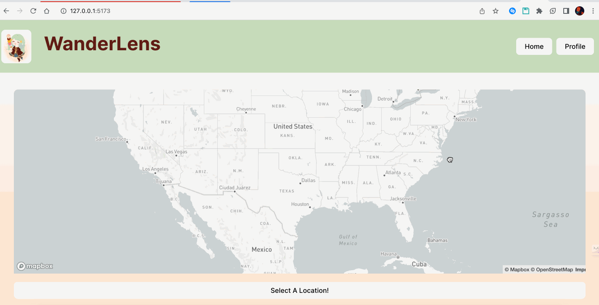
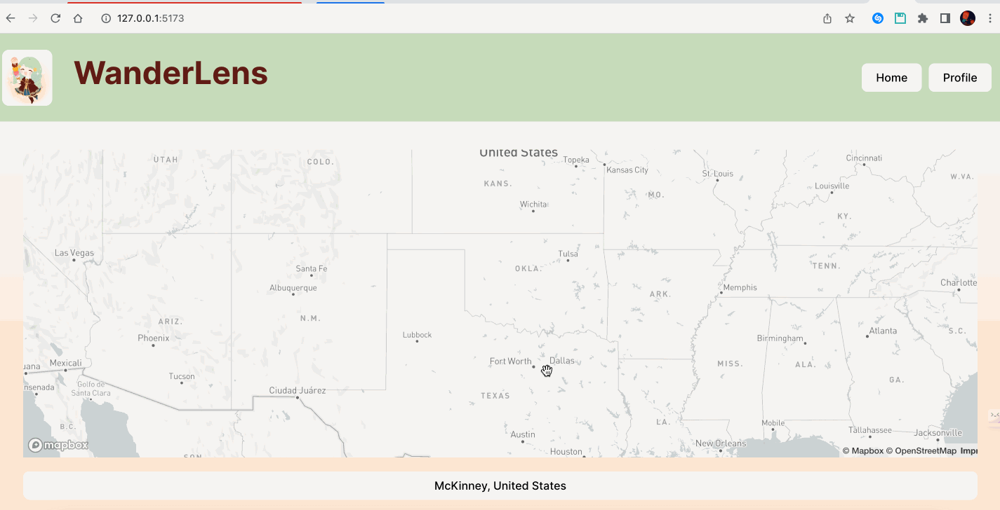
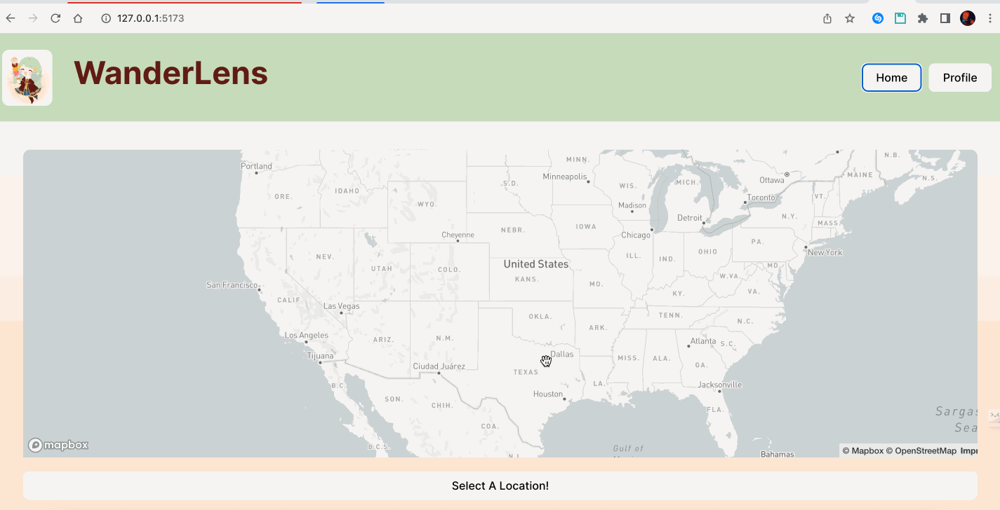
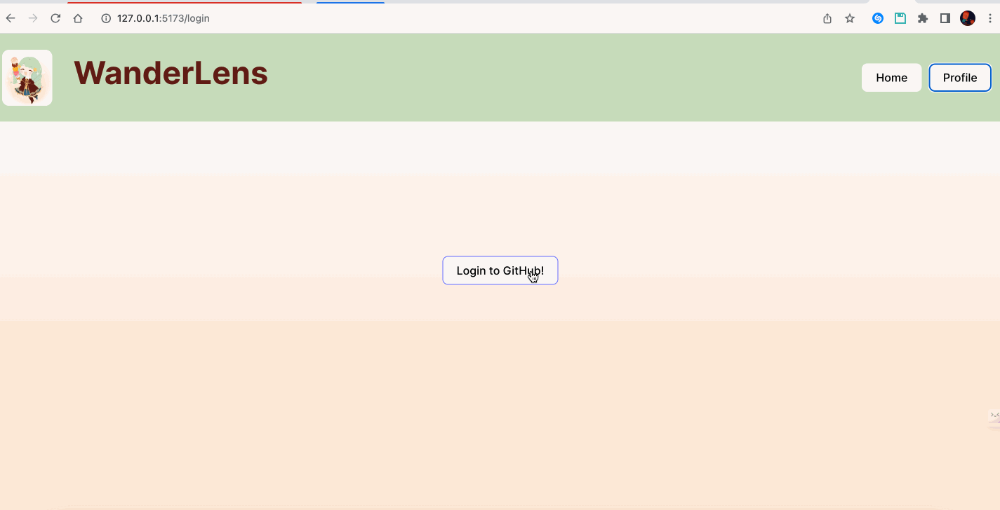
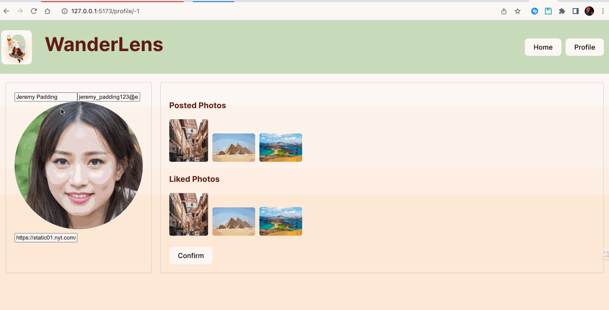

# WanderLens

CodePath WEB103 Final Project

Designed and developed by: Evan Lu & Viet Khue Vu
<!-- 
@evwlu
@kvv190001

🔗 Link to deployed app:   -->

## About

### Description and Purpose

`WanderLens` is an interactive platform for professional photographers to share their
work across the world. Users can navigate the map homepage, which displays a
map of the world with various custom markers that indicate and redirect users
to a gallery of photos that have been taken at that location by various other
users. Users also have the ability to drop Likes on photos, which affect their
relative appearance order in the displayed gallery of photos for each location.
Users also have the ability to log in and upload photos of their own which will
correspondingly appear on the home page.

The purpose of the website is to provide a social media platform for professional
photographers to find and share their photo ideas. When visiting a new location,
we hope that this website can be used to help inspire them in new directions for
photography. 

### Inspiration

When we come to a totally new city, it is usually hard for us to come up with 
new cool photo ideas or we just don't know where are good places in the city for 
us to go take pictures. That is a very common problem with a lot of professional
photographers as well. That's why we came up with an idea to develop an app where
photographers can share their photos with others and to find new photo ideas at a 
specific place.

## Tech Stack

Frontend: React, Mapbox

Backend: Express, PostgreSQL

## Features

### ✅ Interactive Map

Users can use an interactive map to find photos at new locations around the world

### ✅ Uploading new photos

This app allows users to share their cool photos with other professional photographers

### ✅ Interact with others' photos

Users can drop like on the photos that they think are cool

### ✅ Login

Users can login and access their own personal profile

### ✅ Editing

Users can customize their own profiles

## Installation Instructions

1) To get started, clone the repository to your own desktop.

> `git clone https://github.com/evwlu/wanderlens.git`

2) Run `npm install` in the `client` and `server` directory.

3) Run `npm run dev` in the `client` directory and run `npm start` in the `server` directory.
