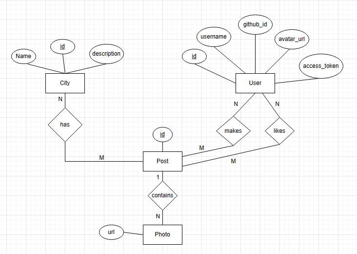
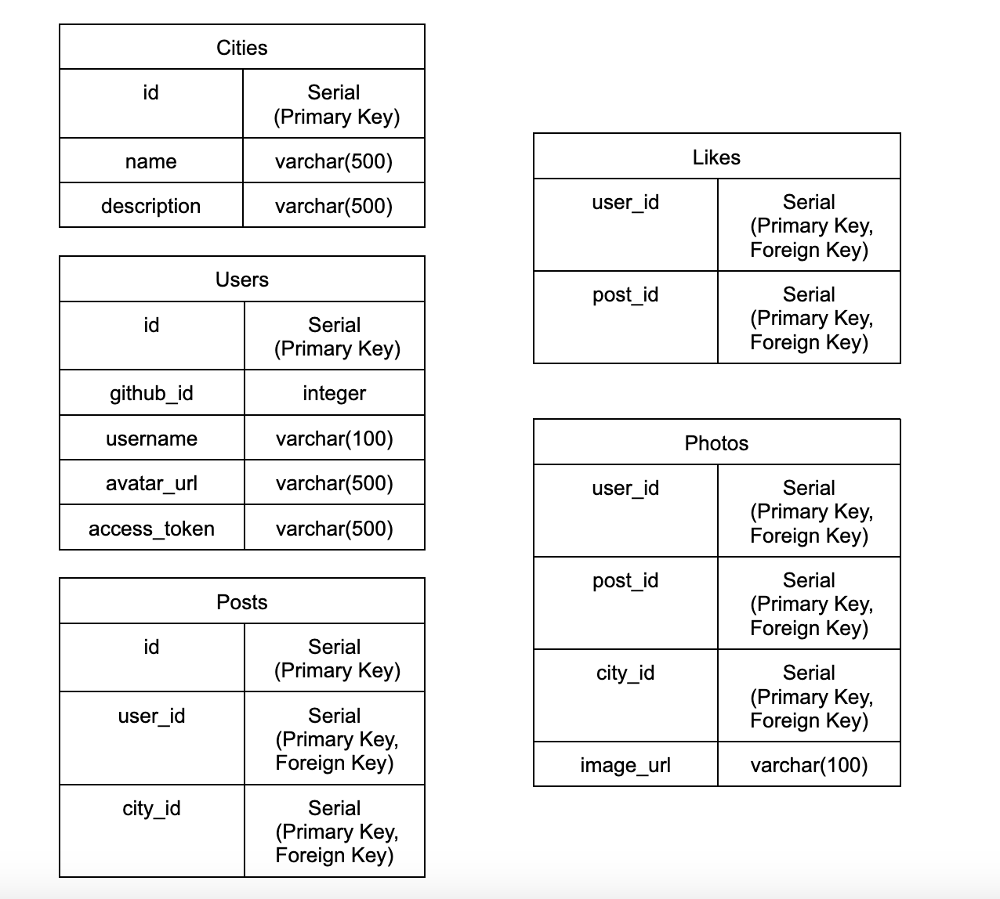

# Entity Relationship Diagram

Reference the Creating an Entity Relationship Diagram final project guide in the course portal for more information about how to complete this deliverable.

## Create the List of Tables

Below are the cities that we'll consider: 
> Cities
> Users
> Posts
> Likes
> Photos

## Entity Relationship Diagram

## Schema

### Cities
| Column Name | Type        | Description        |
|-------------|-------------|--------------------|
| id          | integer     | primary key        |  // primary key
| name        | varchar(500)| city name          |
| description | varchar(500)| city description   |

### Users
| Column Name | Type        | Description        |  
|-------------|-------------|--------------------|
| id          | integer     | primary key        |  // primary key
| username    | varchar(100)| user name          |
| github_id   | integer     | github access id   |
| avatar_url  | varchar(500)| link to user photo |
| access_token| varchar(500)| personal token     |

### Posts
| Column Name | Type        | Description        |
|-------------|-------------|--------------------|
| id          | integer     | primary key        | // primary key
| user_id     | integer     | user who posted    | // primary key, foreign key
| city_id     | integer     | city photo taken in| // primary key, foreign key

### Likes
| Column Name | Type        | Description        |
|-------------|-------------|--------------------|
| user_id     | integer     | user who likes     | // primary key, foreign key
| post_id     | integer     | post being liked   | // primary key, foreign key

### Photos
| Column Name | Type        | Description        |
|-------------|-------------|--------------------|
| id          | integer     | primary key        | // primary key
| user_id     | integer     | user who posted    | // primary key, foreign key
| city_id     | integer     | city photo taken in| // primary key, foreign key
| post_id     | integer     | associated post    | // primary key, foreign key
| image_url   | varchar(100)| photo url          |