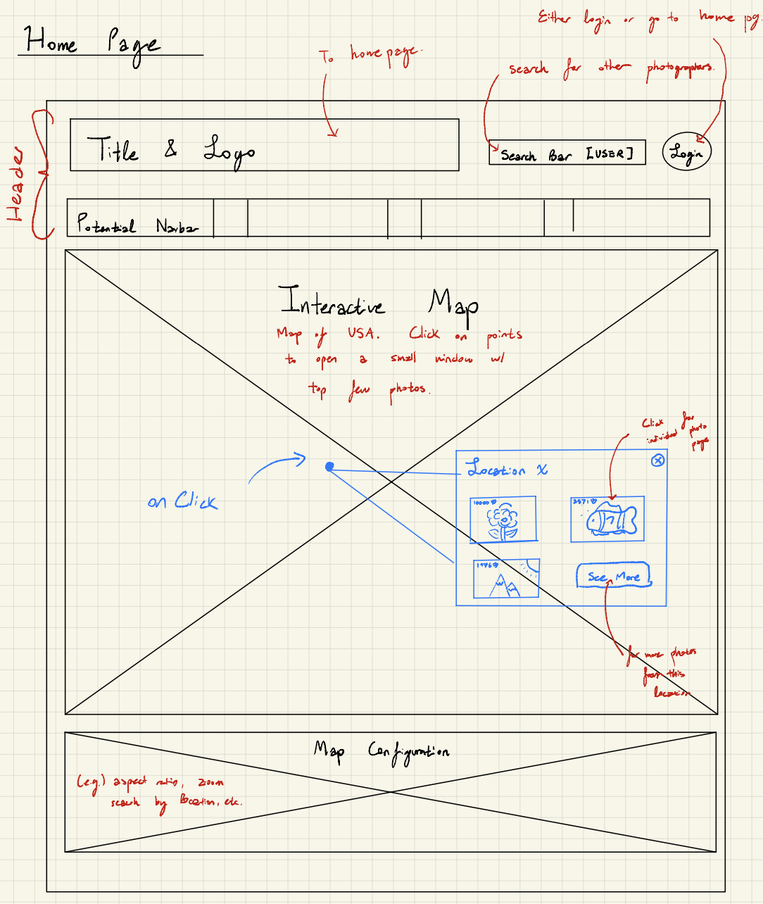
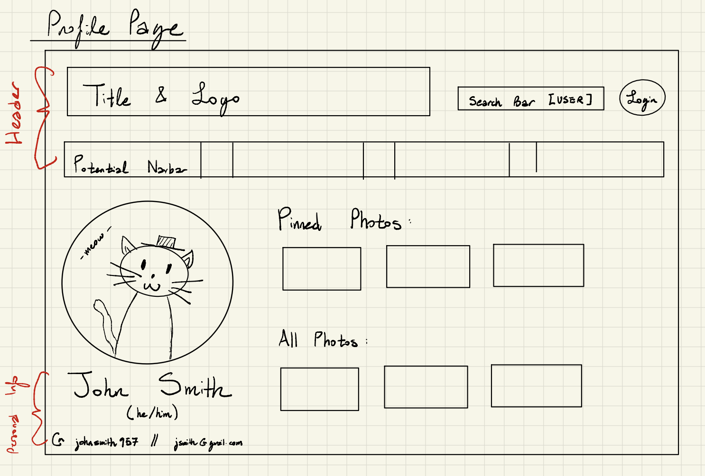
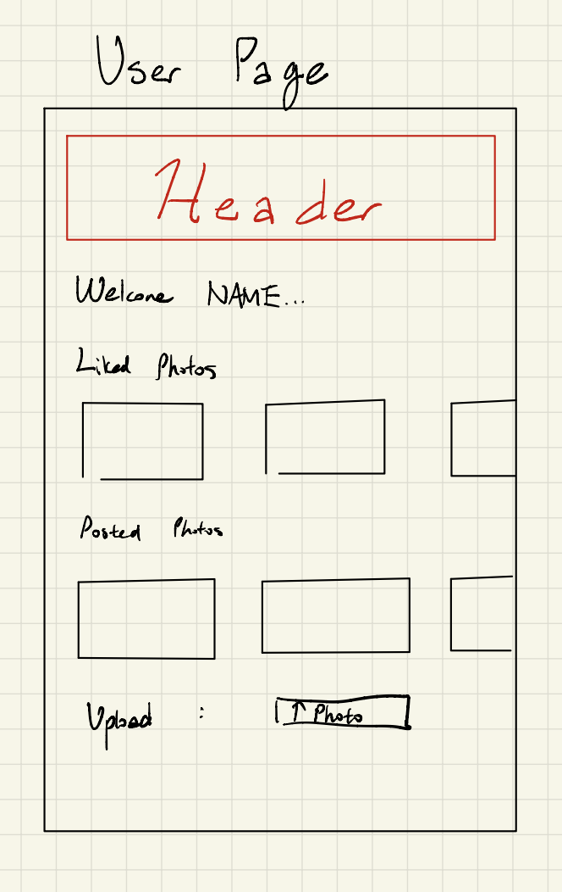
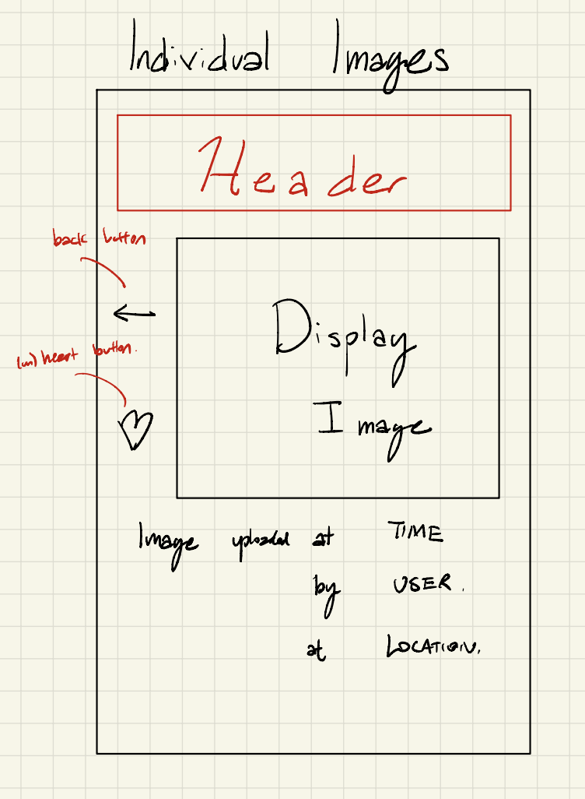

# Wireframes

Reference the Creating an Entity Relationship Diagram final project guide in the course portal for more information about how to complete this deliverable.

## List of Pages

Pages that will be wireframed include, but are not limited to 

## Wireframe 1: Map/Home Page

## Wireframe 2: Profile Page

## Wireframe 3: User Page

## Wireframe 4: Image Page

